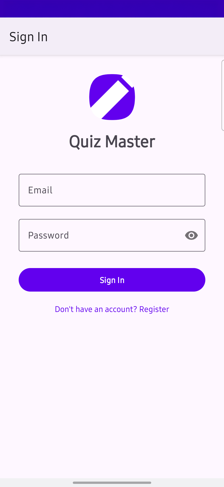
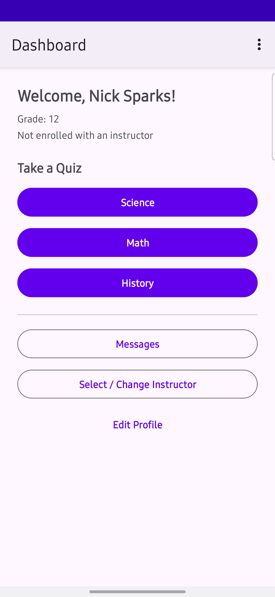
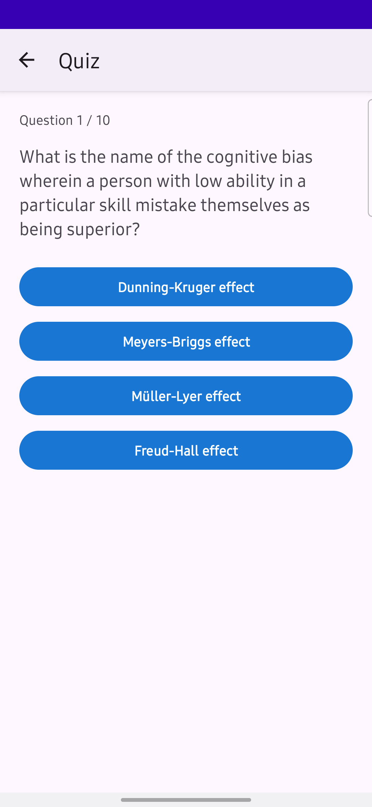

# Quiz Master — Android Native (Kotlin)

A faithful Android port of the [QuizMaster](https://github.com/Monyechi/QuizMaster) ASP.NET MVC web application.

## How This Project Came About

This app started as a full migration exercise: take an existing ASP.NET MVC + Entity Framework classroom quiz platform and rebuild it as a native Android application in Kotlin while keeping feature parity.

The goal was not just a UI clone, but a platform rewrite that demonstrates practical Android engineering decisions:

- Replace server-side session/auth flows with local-first mobile auth and session persistence
- Convert web controller/data patterns into Android MVVM + repository architecture
- Preserve the Student/Instructor role model, profile workflows, messaging, and quiz lifecycle
- Fix known web-version edge cases during the migration (routing consistency and relational data integrity)

## Technical Description

Quiz Master Android uses a layered architecture with clear separation of concerns:

- `UI Layer`: Fragments + ViewModels expose state via LiveData/StateFlow and handle user events
- `Domain/Data Access`: Repositories coordinate local persistence and remote quiz fetches
- `Local Persistence`: Room entities + DAOs for `User`, `Student`, `Instructor`, and `Message`
- `Dependency Injection`: Hilt wires Room, Retrofit, repositories, and app-scoped services
- `Networking`: Retrofit + OkHttp handles API calls and response mapping

Authentication is implemented locally for demo portability:

- Passwords are hashed with SHA-256 + salt before storage
- Session state is stored in SharedPreferences via `SessionManager`
- Role-aware navigation determines Student vs Instructor dashboard flows after login

## Trivia API Used

Quiz questions come from the **Open Trivia DB API**:

- Base endpoint: `https://opentdb.com/api.php`
- Android client: `TriviaApiService` (Retrofit interface)
- Categories mapped in app: Science (`17`), Math (`19`), History (`23`)
- Difficulty supported: Easy, Medium, Hard
- Question handling: HTML decoding + answer shuffling in the repository layer before presenting to UI

API reference: [Open Trivia DB](https://opentdb.com/api_config.php)

## Screenshots

<p float="left">
  
  
  
</p>

## Download APK

[](https://github.com/Monyechi/Quiz-Master-Android-Native/releases)

1. Open the [Releases page](https://github.com/Monyechi/Quiz-Master-Android-Native/releases)
2. Download the latest APK asset
3. Install it on Android (enable "Install unknown apps" if prompted)

## Features

| Feature | Web App | Android App |
|---|---|---|
| Student registration / login | ASP.NET Identity | Room + SHA-256 hash auth |
| Instructor registration / login | ASP.NET Identity | Room + SHA-256 hash auth |
| Role selection at sign-up | Razor Register page | RadioButton (Student / Instructor) |
| Instructor profile (auto-generated key) | ✅ | ✅ |
| Student profile (display name, grade) | ✅ | ✅ |
| Student self-enrollment | ✅ | ✅ (student selects instructor) |
| Instructor-managed student enrollment | ✅ | ✅ (instructor assigns unassigned students) |
| Science / Math / History quizzes | opentdb.com (client-side JS) | opentdb.com via Retrofit |
| Easy / Medium / Hard difficulty | ✅ | ✅ |
| Quiz result screen | In-page alert | Dedicated result fragment with score & rating |
| Student → Instructor messaging | ✅ | ✅ |
| Instructor → Student messaging | ✅ | ✅ |
| Bidirectional messaging verified | N/A | ✅ (unit + instrumentation tests) |
| Inbox (received messages) | ✅ | ✅ |
| Session management | ASP.NET cookie auth | SharedPreferences |
| Logout | ✅ | Overflow menu → Logout |

## Architecture

```
app/
 └── src/main/java/com/quizmaster/app/
      ├── data/
      │   ├── local/
      │   │   ├── entity/          # Room entities: User, Instructor, Student, Message
      │   │   ├── dao/             # DAOs for each entity
      │   │   └── QuizMasterDatabase.kt
      │   ├── remote/
      │   │   ├── api/             # TriviaApiService (Open Trivia DB)
      │   │   └── model/           # TriviaResponse, TriviaQuestion
      │   └── repository/          # AuthRepository, InstructorRepository, StudentRepository,
      │                            # MessageRepository, QuizRepository
      ├── di/
      │   └── AppModule.kt         # Hilt DI: Room, Retrofit, DAOs
      ├── ui/
      │   ├── auth/                # LoginFragment, RegisterFragment, AuthViewModel
      │   ├── student/             # Dashboard, Create/Edit Profile, SelectInstructor
      │   ├── instructor/          # Dashboard, Create/Edit Profile, adapters
      │   ├── quiz/                # QuizPicker, Quiz, QuizResult, QuizViewModel
      │   └── message/             # Inbox, ComposeMessage, MessageViewModel
      ├── util/
      │   └── SessionManager.kt    # SharedPreferences-backed session
      └── QuizMasterApp.kt         # @HiltAndroidApp
```

**Stack:** Kotlin · Jetpack Navigation · Room · Hilt · Retrofit · Coroutines · Flow · LiveData · Material 3

## Quiz Categories

| Category | Open Trivia DB ID |
|---|---|
| Science & Nature | 17 |
| Mathematics | 19 |
| History | 23 |

## Getting Started

1. Clone the repo
2. Open in Android Studio Hedgehog or later
3. Let Gradle sync
4. Run on emulator or device (min SDK 24)

## Improvements over the Web App

- Fixed the Math/History quiz routing bug (all 3 subjects + all 3 difficulties correctly wired)
- Replaced denormalized `InstructorName` string with a proper FK (`instructorId`) on `StudentEntity`
- Replaced the typo `Reciever` with `receiver` throughout
- Messages use real user IDs instead of plain-string matching
- All quiz logic runs natively (no WebView / JS bridge)
